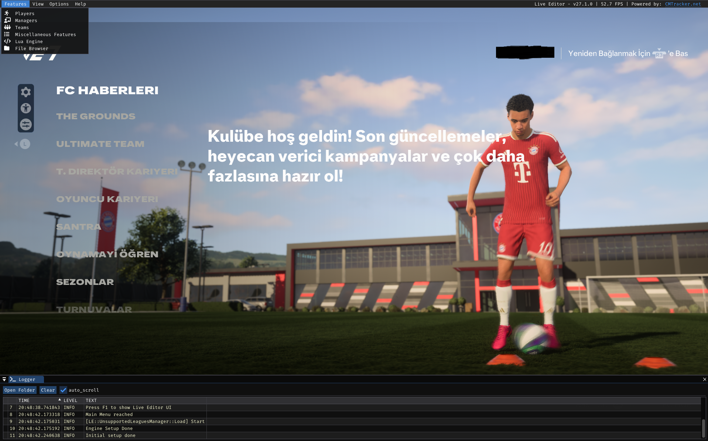

# FC 27 Live Editor

Edits FC 27 Career Mode while the game is running. Players, teams, managers: change it
and it's live. No save-file editing, no restart. Hit F1 to open the menu.

## What's in it
- Players: attributes, positions, playstyles (Manager Career)
- Teams and managers
- Youth scout report generator
- Legacy file browser
- Speedhack (menus for now)
- Lua engine

## Run it
1. Download the `.rar` from [releases](../../releases) and extract it.
2. Run `LauncherNoAuth.exe`. It launches the game for you.
3. Press F1 in-game.

## about the "donation"
The original is free the same way a club is free: you get in eventually, once everyone
who paid has already walked past the line. Every game update the free crowd gets sent
back to the waiting room while the patrons skip straight through. That's not a donation,
it's a cover charge with a charity sticker slapped on it. This build has no line.
